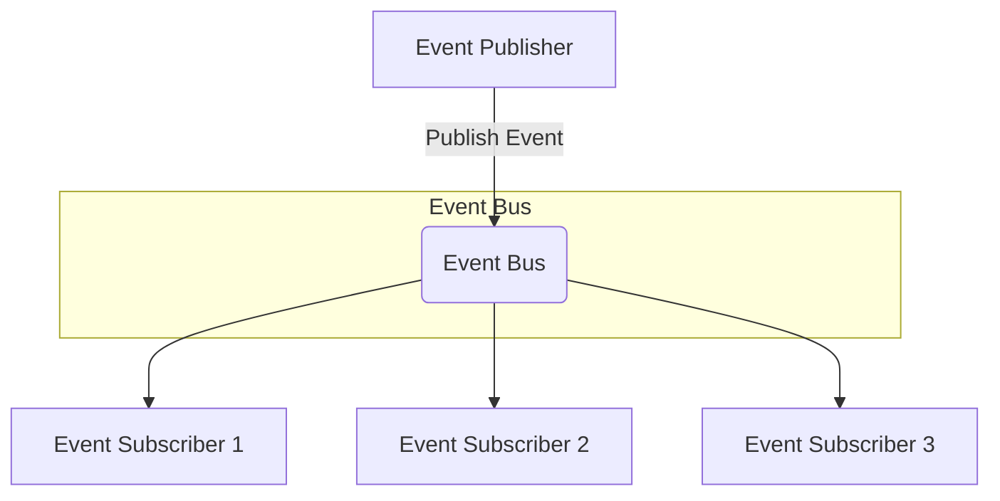

# SimpleEventBus

Provider Simple event bus and fluent settings




## Install


## Registration

In .Net Core Web or API `Program.cs`


```csharp

builder.Services.AddEventBus
(
    o => o.UseInMemory()
          .AddProfile<OrderSubscriptionProfile>()
          .AddHandlersFromAssemblies(typeof(Program).Assembly);
);

builder.Services.AddControllers();    
```
or

```csharp

```csharp

builder.Services.AddEventBus
(
    o => o.UseInMemory()
          .AddProfile
          (
                p => p.WhenOccurs<OrderPlacedEvent>().ToDo<EmailService>() 
                                                .ToDo<SmsService>();
          )
          .AddHandlersFromAssemblies(typeof(Program).Assembly);
);

builder.Services.AddControllers();    
```


### Publisher

this is event class.

```csharp
public class OrderPlacedEvent 
{
    public Guid Id { get; set; }
}
```


```csharp!
private readonly IEventPublisher _eventPublisher;

public async Task<IActionResult> Index()
{
    var orderPlacedEvent = new OrderPlacedEvent
    {
        
    };
    
    await _eventPublisher.PublisherAsync(orderPlacedEvent);
}
```

### Subscriber


There are two ways to implement an EventHandler. The first is by implementing the IEventHandler interface, and the second is by implementing a delegate method.

### 1.Implementing the `SimpleEventBus.IEventHandler<TEvent>` interface

```csharp

public class EmailService : IEventHandler<OrderPlacedEvent> 
{
    private IEmailClient _emailClient;


    public EmailService(IEmailClient emailClient)
    {
        this._emailClient = emailClient;
    }

    public Task HandleAsync(OrderPlacedEvent @event,
                            Headers headers,
                            CancellationToken cancellationToken)
    {
        // your code
        
    }
}

```

Create `OrderSubscriptionProfile.cs`


```csharp

public class OrderSubscriptionProfile : SubscriptionProfile
{
    public OrderSubscriptionProfile()
    {
        WhenOccurs<OrderPlacedEvent>().ToDo<EmailService>() 
                                      .ToDo<SmsService>();
    }
}
```

- Explanation:
    - WhenOccurs<OrderPlacedEvent>(): This method registers an event listener for the OrderPlacedEvent. It means whenever an order is placed, the following actions (event handlers) will be triggered.

    - ToDo<EmailService>(): This line specifies that the EmailService will handle the OrderPlacedEvent. The EmailService will likely contain a method to send an order confirmation email when the event occurs.

    - ToDo<SmsService>(): Similarly, this line registers the SmsService as an additional handler for the same event. The SmsService might be responsible for sending a confirmation SMS message to the customer.


### 2.Implementing the `Func<object,IDictionary<string,object>,CancellationToken>` method

```csharp

public class AppService : IAppService
{

	public Task PushAsync(OrderPlacedEvent @event, IDictionary<string,object> headers, CancellationToken cancellationToken)
	{
		// 
	}
}

```

`OrderSubscriptionProfile.cs`

```csharp

public class OrderSubscriptionProfile : SubscriptionProfile
{
    public OrderSubscriptionProfile()
    {
        WhenOccurs<OrderPlacedEvent>().ToDo<IAppService>(e => e.PushAsync) 
                                      .ToDo<ISmsService>(s => s.SendAsync);
    }
}
```

- Explanation:
    - WhenOccurs<OrderPlacedEvent>(): This registers an event listener for the OrderPlacedEvent, which means when an order is placed, the following handlers will be triggered.

    - ToDo<IAppService>(e => e.PushAsync): This specifies that when the OrderPlacedEvent occurs, the IAppService will handle the event, and the PushAsync method will be called. This method might push a notification to a mobile app or another channel that the order has been placed.

    - ToDo<ISmsService>(s => s.SendAsync): In addition to the app notification, the ISmsService will also handle the event, and the SendAsync method will be invoked. This likely sends an SMS notification to the customer informing them of the order placement.


## SimpleEventBus.RabbitMq


```csharp
void Main()
{
	IServiceCollection services = new ServiceCollection();
	services.AddEventBus
	(
		e => e.UseRabbitMq(o => 
		{
			o.UserName = "guest";
		},
		RabbitMqBindingConfiguration.ConfigureBindings  
	));
	
}

public static class RabbitMqBindingConfiguration
{
	public static void ConfigureBindings(RabbitMqBindingOption option) 
	{
		option.DeclareGlobalExchange("sample.exchange")
              .DeclareGlobalQueue("sample.queue");
		
		option.ForEvent<OrderPlacedEvent>()
              .DeclareExchange("sample.exchange.order")
              .DeclareQueue(nameof(OrderPlacedEvent));
	}
}

public class OrderPlacedEvent 
{
	
}
```