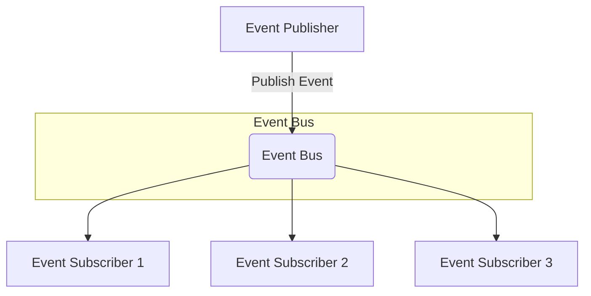

# SimpleEventBus

Simple event bus library for .NET with fluent subscription profiles.

## Packages

<<<<<<< HEAD

```mermaid

graph TD
    A[Event Publisher] -->|Publish Event| B(Event Bus)
    B --> C[Event Subscriber 1]
    B --> D[Event Subscriber 2]
    B --> E[Event Subscriber 3]

    subgraph "Event Bus"
        B
    end
```

## Install
=======
- `SimpleEventBus`: core abstractions and profile system
- `SimpleEventBus.InMemory`: in-process transport
- `SimpleEventBus.RabbitMq`: RabbitMQ transport
>>>>>>> feature/BuildEventHandlerExecutor

## Target Frameworks

<<<<<<< HEAD

## Registration

In .Net Core Web or API `Program.cs`
=======
- `net6.0`
- `net8.0`
- `net9.0`
- `net10.0`
>>>>>>> feature/BuildEventHandlerExecutor

## Quick Start (In-Memory)

### 1. Define event and handler

```csharp
using SimpleEventBus.Event;
using SimpleEventBus.Subscriber;

<<<<<<< HEAD
builder.Services.AddEventBus
(
    o => o.UseInMemory()
          .AddProfile<OrderSubscriptionProfile>()
          .AddHandlersFromAssemblies(typeof(Program).Assembly);
);

builder.Services.AddControllers();    
```
or

```csharp

```csharp

builder.Services.AddEventBus
(
    o => o.UseInMemory()
          .AddProfile
          (
                p => p.WhenOccurs<OrderPlacedEvent>().ToDo<EmailService>() 
                                                .ToDo<SmsService>();
          )
          .AddHandlersFromAssemblies(typeof(Program).Assembly);
);

builder.Services.AddControllers();    
```


### Publisher

this is event class.

```csharp
public class OrderPlacedEvent 
{
    public Guid Id { get; set; }
}
```


```csharp!
private readonly IEventPublisher _eventPublisher;

public async Task<IActionResult> Index()
=======
public sealed record OrderPlaced(Guid OrderId);

public sealed class OrderPlacedHandler : IEventHandler<OrderPlaced>
>>>>>>> feature/BuildEventHandlerExecutor
{
    public Task HandleAsync(OrderPlaced @event, Headers headers, CancellationToken cancellationToken)
    {
<<<<<<< HEAD
        
    };
    
    await _eventPublisher.PublisherAsync(orderPlacedEvent);
}
```

### Subscriber


There are two ways to implement an EventHandler. The first is by implementing the IEventHandler interface, and the second is by implementing a delegate method.

### 1.Implementing the `SimpleEventBus.IEventHandler<TEvent>` interface

```csharp

public class EmailService : IEventHandler<OrderPlacedEvent> 
{
    private IEmailClient _emailClient;


    public EmailService(IEmailClient emailClient)
    {
        this._emailClient = emailClient;
    }

    public Task HandleAsync(OrderPlacedEvent @event,
                            Headers headers,
                            CancellationToken cancellationToken)
    {
        // your code
        
    }
}

```

Create `OrderSubscriptionProfile.cs`


```csharp

public class OrderSubscriptionProfile : SubscriptionProfile
{
    public OrderSubscriptionProfile()
    {
        WhenOccurs<OrderPlacedEvent>().ToDo<EmailService>() 
                                      .ToDo<SmsService>();
=======
        Console.WriteLine($"Handled order: {@event.OrderId}");
        return Task.CompletedTask;
>>>>>>> feature/BuildEventHandlerExecutor
    }
}
```

<<<<<<< HEAD
- Explanation:
    - WhenOccurs<OrderPlacedEvent>(): This method registers an event listener for the OrderPlacedEvent. It means whenever an order is placed, the following actions (event handlers) will be triggered.

    - ToDo<EmailService>(): This line specifies that the EmailService will handle the OrderPlacedEvent. The EmailService will likely contain a method to send an order confirmation email when the event occurs.

    - ToDo<SmsService>(): Similarly, this line registers the SmsService as an additional handler for the same event. The SmsService might be responsible for sending a confirmation SMS message to the customer.


### 2.Implementing the `Func<object,IDictionary<string,object>,CancellationToken>` method
=======
### 2. Define a subscription profile
>>>>>>> feature/BuildEventHandlerExecutor

```csharp
using SimpleEventBus;
using SimpleEventBus.Profile;

<<<<<<< HEAD
public class AppService : IAppService
{

	public Task PushAsync(OrderPlacedEvent @event, IDictionary<string,object> headers, CancellationToken cancellationToken)
	{
		// 
	}
}

```

`OrderSubscriptionProfile.cs`

```csharp

public class OrderSubscriptionProfile : SubscriptionProfile
{
    public OrderSubscriptionProfile()
    {
        WhenOccurs<OrderPlacedEvent>().ToDo<IAppService>(e => e.PushAsync) 
                                      .ToDo<ISmsService>(s => s.SendAsync);
=======
public sealed class OrderProfile : SubscriptionProfile
{
    public OrderProfile()
    {
        this.WhenOccurs<OrderPlaced>()
            .ToDo<OrderPlacedHandler>();
>>>>>>> feature/BuildEventHandlerExecutor
    }
}
```

<<<<<<< HEAD
- Explanation:
    - WhenOccurs<OrderPlacedEvent>(): This registers an event listener for the OrderPlacedEvent, which means when an order is placed, the following handlers will be triggered.

    - ToDo<IAppService>(e => e.PushAsync): This specifies that when the OrderPlacedEvent occurs, the IAppService will handle the event, and the PushAsync method will be called. This method might push a notification to a mobile app or another channel that the order has been placed.

    - ToDo<ISmsService>(s => s.SendAsync): In addition to the app notification, the ISmsService will also handle the event, and the SendAsync method will be invoked. This likely sends an SMS notification to the customer informing them of the order placement.


## SimpleEventBus.RabbitMq

=======
### 3. Register EventBus
>>>>>>> feature/BuildEventHandlerExecutor

```csharp
using Microsoft.Extensions.DependencyInjection;
using Microsoft.Extensions.Hosting;
using SimpleEventBus.DependencyInjection;

var host = Host.CreateDefaultBuilder(args)
    .ConfigureServices(services =>
    {
        services.AddEventBus(builder =>
        {
            builder.WithProfile<OrderProfile>();
            builder.ScanHandlersFrom(typeof(OrderProfile).Assembly);
            builder.UseInMemoryTransport();
        });
    })
    .Build();

await host.StartAsync();
```

### 4. Publish event

```csharp
using Microsoft.Extensions.DependencyInjection;

var publisher = host.Services.GetRequiredService<IEventPublisher>();
await publisher.PublishAsync(new OrderPlaced(Guid.NewGuid()));
```

## RabbitMQ Transport

```csharp
services.AddEventBus(builder =>
{
    builder.WithProfile<OrderProfile>();
    builder.ScanHandlersFrom(typeof(OrderProfile).Assembly);
    builder.UseRabbitMqTransport(
        opt =>
        {
            opt.Host = "localhost";
            opt.UserName = "guest";
            opt.Password = "guest";
        },
        bind =>
        {
            bind.GlobalExchange = "eventbus.topic";
            bind.GlobalQueue = "simpleeventbus.orders";
            bind.PrefetchCount = 10;
        });
});
```

You can also bind specific events:

```csharp
bind.ForEvent<OrderPlaced>()
    .DeclareExchange("orders.exchange")
    .DeclareQueue("orders.queue");
```

## Event Naming

- Default key format: `{domain}.{entity}.{event}.v{version}`
- Use `EventAttribute` to customize name/version.
- Routing details: `docs/eventbus-routing.md`

Example:

```csharp
using SimpleEventBus.Mapper;

[Event("order.payment.created", 2)]
public sealed record OrderPaymentCreated(Guid PaymentId);
```

Resulting event name: `order.payment.created.v2`

## Routing Defaults (from docs)

Based on `docs/eventbus-routing.md`:

- Default exchange: `eventbus.topic`
- Default queue format: `{service}.{environment}`
- `RabbitMqBindingOption.ServiceName` default: `app`
- `RabbitMqBindingOption.EnvironmentName` default: `prod`
- Default prefetch: `10`

If a per-event binding is not configured, RabbitMQ transport falls back to global/default values.

## Docs

- Routing design: `docs/eventbus-routing.md`

## Build and Test

```bash
dotnet build src/SimpleEventBus.sln -c Release
dotnet test src/SimpleEventBus.sln -c Release
```
