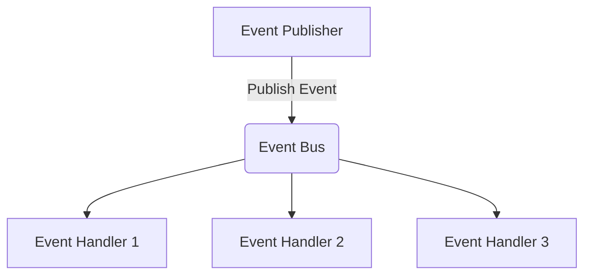

# FluentEventBus

[](https://github.com/Ian26875/FluentEventBus/actions/workflows/ci.yml)
[](https://github.com/Ian26875/FluentEventBus/actions/workflows/release.yml)
[](https://www.nuget.org/packages/FluentEventBus)
[](LICENSE)

[English](Readme.md) | [繁體中文](Readme.zh-TW.md)

Simple event bus library for .NET with fluent subscription profiles.


```mermaid
graph TD
    P[Event Publisher] -->|Publish Event| B(Event Bus)
    B --> S1[Event Handler 1]
    B --> S2[Event Handler 2]
    B --> S3[Event Handler 3]
```

## Packages

Published on NuGet as the **FluentEventBus** family:

| NuGet package | Project | Purpose |
|---|---|---|
| `FluentEventBus` | `FluentEventBus` | Core abstractions and profile system |
| `FluentEventBus.InMemory` | `FluentEventBus.InMemory` | In-process transport |
| `FluentEventBus.RabbitMq` | `FluentEventBus.RabbitMq` | RabbitMQ transport |

## Target Frameworks

- `net6.0`
- `net7.0`
- `net8.0`
- `net9.0`
- `net10.0`

## Quick Start (In-Memory)

### 1. Define event and handler

```csharp
using FluentEventBus.Event;
using FluentEventBus.Subscriber;

public sealed record OrderPlaced(Guid OrderId);

public sealed class OrderPlacedHandler : IEventHandler<OrderPlaced>
{
    public Task HandleAsync(OrderPlaced @event, Headers headers, CancellationToken cancellationToken)
    {
        Console.WriteLine($"Handled order: {@event.OrderId}");
        return Task.CompletedTask;
    }
}
```

### 2. Define a subscription profile

```csharp
using FluentEventBus.Profile;

public sealed class OrderProfile : SubscriptionProfile
{
    public OrderProfile()
    {
        this.WhenOccurs<OrderPlaced>()
            .ToDo<OrderPlacedHandler>();
    }
}
```

A profile can also bind a method on any registered service instead of an `IEventHandler<TEvent>` (signature: `(TEvent, Headers, CancellationToken) => Task` or `(TEvent, CancellationToken) => Task`), and attach an exception handler:

```csharp
this.WhenOccurs<OrderPlaced>()
    .ToDo<INotificationService>(s => s.PushAsync)
    .CatchExceptionToDo<OrderPlacedExceptionHandler>();
```

### 3. Register EventBus

```csharp
using Microsoft.Extensions.DependencyInjection;
using Microsoft.Extensions.Hosting;
using FluentEventBus.DependencyInjection;

var host = Host.CreateDefaultBuilder(args)
    .ConfigureServices(services =>
    {
        services.AddEventBus(builder =>
        {
            builder.WithProfile<OrderProfile>();
            builder.ScanHandlersFrom(typeof(OrderProfile).Assembly);
            builder.UseInMemoryTransport();
        });
    })
    .Build();

await host.StartAsync();
```

Shorthand for a single profile:

```csharp
services.AddEventBusWithProfile<OrderProfile, Program>();
```

### 4. Publish event

```csharp
using Microsoft.Extensions.DependencyInjection;

var publisher = host.Services.GetRequiredService<IEventPublisher>();
await publisher.PublishAsync(new OrderPlaced(Guid.NewGuid()));
```

## RabbitMQ Transport

```csharp
services.AddEventBus(builder =>
{
    builder.WithProfile<OrderProfile>();
    builder.ScanHandlersFrom(typeof(OrderProfile).Assembly);
    builder.UseRabbitMqTransport(
        opt =>
        {
            opt.Host = "localhost";
            opt.UserName = "guest";
            opt.Password = "guest";
        },
        bind =>
        {
            bind.GlobalExchange = "eventbus.topic";
            bind.GlobalQueue = "fluenteventbus.orders";
            bind.PrefetchCount = 10;
        });
});
```

You can also bind specific events:

```csharp
bind.ForEvent<OrderPlaced>()
    .DeclareExchange("orders.exchange")
    .DeclareQueue("orders.queue");
```

## Delivery Semantics, Retry and Dead Letter

Failed handlers propagate their exception to the transport (unless an
`IEventExceptionHandler` registered via `CatchExceptionToDo<T>()` sets
`context.Handled = true`, which acks and drops the message). The transport then retries:

- **RabbitMQ**: the message is republished with an incremented `x-retry-count` header,
  up to `MaxRetryCount` (default `3`). After that it is nacked without requeue —
  dead-lettered when a dead letter exchange is configured, dropped otherwise.
- **In-Memory**: the event is re-enqueued with the same counter, up to `MaxRetryCount`
  (default `3`). After that `OnPoisonMessage` is invoked (if set) and the event is dropped.

This makes delivery **at-least-once**: handlers must be idempotent — use
`Headers.MessageId` as the deduplication key.

Configure a dead letter exchange/queue for RabbitMQ:

```csharp
bind.DeclareGlobalDeadLetter("eventbus.dlx", "fluenteventbus.orders.dlq");
bind.MaxRetryCount = 3;

// or per event
bind.ForEvent<OrderPlaced>()
    .DeclareExchange("orders.exchange")
    .DeclareQueue("orders.queue")
    .WithDeadLetter("orders.dlx", "orders.dlq");
```

Configure the in-memory poison message hook:

```csharp
builder.UseInMemoryTransport(
    maxRetryCount: 3,
    onPoisonMessage: (context, exception) =>
    {
        Console.WriteLine($"Poison event {context.EventName}: {exception.Message}");
        return Task.CompletedTask;
    });
```

## Message Headers

Every message carries a `Headers` dictionary. Well-known headers:

| Header | Set by | Purpose |
|---|---|---|
| `MessageId` | Publisher, automatically (GUID) when absent | Unique message id — the deduplication key for at-least-once delivery |
| `OccurredAt` | Publisher, automatically (UTC, ISO-8601) when absent | When the event was published |
| `CorrelationId` | Caller (optional) | End-to-end tracing across services |
| `x-retry-count` | Transport | Redelivery counter for the retry/dead-letter flow |

```csharp
await publisher.PublishAsync(orderPlaced, new Headers { CorrelationId = requestId });

// consumer side
public Task HandleAsync(OrderPlaced @event, Headers headers, CancellationToken ct)
{
    var messageId = headers.MessageId;   // dedup key
    var occurredAt = headers.OccurredAt; // DateTimeOffset?
    ...
}
```

The message body contract is the JSON payload plus the logical event name — CLR
type names, namespaces and assembly names never appear on the wire. Consumers map
the logical name back to their own local type, so producer-side refactors and
non-.NET consumers are both safe.

## Event Naming

- Default key format: `{domain}.{entity}.{event}.v{version}`
- Use `EventAttribute` to customize name/version.
- Routing details: `docs/eventbus-routing.md`

Example:

```csharp
using FluentEventBus.Mapper;

[Event("order.payment.created", 2)]
public sealed record OrderPaymentCreated(Guid PaymentId);
```

Resulting event name: `order.payment.created.v2`

## Event Versioning

The version is part of the routing key (`...created.v1` / `...created.v2`), so each
version is its own channel and old and new versions coexist during migration.

**When to stay on the same version** — additive, non-breaking changes only:
adding a new optional field. Payloads are JSON; old consumers ignore fields
they don't know.

**When to bump the version** — any breaking change: renaming or removing a
field, changing a field's type, or changing the meaning of the event.

**How to bump** — define a *new* CLR type; never mutate the existing one
(`EventMapper` maps type ↔ name one-to-one, one type cannot carry two versions):

```csharp
[Event("order.payment.created", 1)]
public sealed record OrderPaymentCreated(Guid PaymentId);

[Event("order.payment.created", 2)]
public sealed record OrderPaymentCreatedV2(Guid PaymentId, string Currency);
```

**Migration path**:

1. Consumers subscribe to both versions side by side:

   ```csharp
   this.WhenOccurs<OrderPaymentCreated>().ToDo<PaymentHandler>();
   this.WhenOccurs<OrderPaymentCreatedV2>().ToDo<PaymentHandlerV2>();
   ```

2. Producers switch to publishing v2.
3. Watch the v1 queue drain to zero, then remove the v1 subscription and type.

**Why major-only**: `EventAttribute` deliberately carries only a major version.
Minor/patch changes don't alter the wire contract, so they have no business in
the routing key.

**Contract stability**: events shared across services should always use an
explicit `[Event("name", n)]` attribute. Without it the name is derived from
the type name and namespace, and a refactor silently changes the routing key —
a breaking change the compiler will not catch.

## Routing Defaults

Based on `docs/eventbus-routing.md`:

- Default exchange: `eventbus.topic`
- Default queue format: `{service}.{environment}`
- `RabbitMqBindingOption.ServiceName` default: `app`
- `RabbitMqBindingOption.EnvironmentName` default: `prod`
- Default prefetch: `10`

If a per-event binding is not configured, RabbitMQ transport falls back to global/default values.

## Performance

Measured with the bundled stress harness (`src/FluentEventBus.StressTests`) on a
developer machine — one publisher process with 8 parallel producers, one
counting handler, zero message loss across all runs:

| Scenario | Events | Publish throughput | End-to-end throughput |
|---|---|---|---|
| In-Memory | 100,000 | ~1,150,000 msg/s | ~245,000 msg/s |
| RabbitMQ (Docker, prefetch 200) | 10,000 | ~48,000 msg/s | ~10,500 msg/s |
| RabbitMQ (Docker, prefetch 200) | 100,000 | ~83,000 msg/s | ~16,000 msg/s |

Numbers are indicative, not a formal benchmark — run it yourself:

```bash
# In-Memory
dotnet run -c Release --project src/FluentEventBus.StressTests -- inmemory 100000

# RabbitMQ against a Docker sandbox
docker run -d --name eventbus-stress -p 5673:5672 rabbitmq:4-alpine
dotnet run -c Release --project src/FluentEventBus.StressTests -- rabbitmq localhost:5673 100000
docker rm -f eventbus-stress
```

Relevant design choices: handler delegates and lambda expressions are compiled
once and cached; the RabbitMQ publisher caches exchange declarations (one broker
round-trip per exchange per process); all RabbitMQ components share a single
connection; each handler executes in its own DI scope.

## Docs

- Routing design: `docs/eventbus-routing.md`

## Build and Test

```bash
dotnet build src/FluentEventBus.sln -c Release
dotnet test src/FluentEventBus.sln -c Release
```
