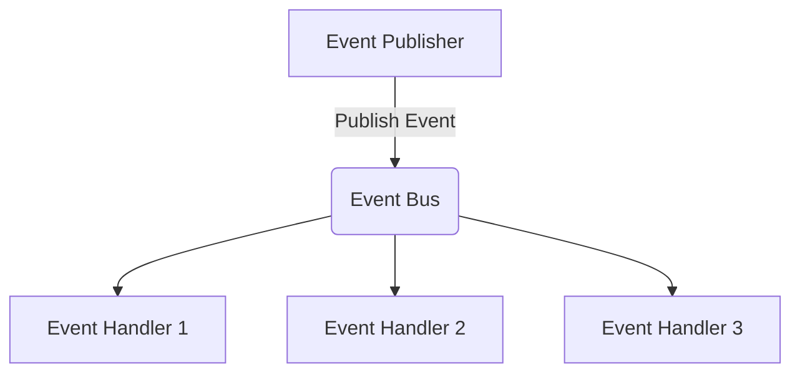

# SimpleEventBus

[English](Readme.md) | [繁體中文](Readme.zh-TW.md)

Simple event bus library for .NET with fluent subscription profiles.


```mermaid
graph TD
    P[Event Publisher] -->|Publish Event| B(Event Bus)
    B --> S1[Event Handler 1]
    B --> S2[Event Handler 2]
    B --> S3[Event Handler 3]
```

## Packages

- `SimpleEventBus`: core abstractions and profile system
- `SimpleEventBus.InMemory`: in-process transport
- `SimpleEventBus.RabbitMq`: RabbitMQ transport

## Target Frameworks

- `net6.0`
- `net8.0`
- `net9.0`
- `net10.0`

## Quick Start (In-Memory)

### 1. Define event and handler

```csharp
using SimpleEventBus.Event;
using SimpleEventBus.Subscriber;

public sealed record OrderPlaced(Guid OrderId);

public sealed class OrderPlacedHandler : IEventHandler<OrderPlaced>
{
    public Task HandleAsync(OrderPlaced @event, Headers headers, CancellationToken cancellationToken)
    {
        Console.WriteLine($"Handled order: {@event.OrderId}");
        return Task.CompletedTask;
    }
}
```

### 2. Define a subscription profile

```csharp
using SimpleEventBus.Profile;

public sealed class OrderProfile : SubscriptionProfile
{
    public OrderProfile()
    {
        this.WhenOccurs<OrderPlaced>()
            .ToDo<OrderPlacedHandler>();
    }
}
```

A profile can also bind a method on any registered service instead of an `IEventHandler<TEvent>` (signature: `(TEvent, Headers, CancellationToken) => Task` or `(TEvent, CancellationToken) => Task`), and attach an exception handler:

```csharp
this.WhenOccurs<OrderPlaced>()
    .ToDo<INotificationService>(s => s.PushAsync)
    .CatchExceptionToDo<OrderPlacedExceptionHandler>();
```

### 3. Register EventBus

```csharp
using Microsoft.Extensions.DependencyInjection;
using Microsoft.Extensions.Hosting;
using SimpleEventBus.DependencyInjection;

var host = Host.CreateDefaultBuilder(args)
    .ConfigureServices(services =>
    {
        services.AddEventBus(builder =>
        {
            builder.WithProfile<OrderProfile>();
            builder.ScanHandlersFrom(typeof(OrderProfile).Assembly);
            builder.UseInMemoryTransport();
        });
    })
    .Build();

await host.StartAsync();
```

Shorthand for a single profile:

```csharp
services.AddEventBusWithProfile<OrderProfile, Program>();
```

### 4. Publish event

```csharp
using Microsoft.Extensions.DependencyInjection;

var publisher = host.Services.GetRequiredService<IEventPublisher>();
await publisher.PublishAsync(new OrderPlaced(Guid.NewGuid()));
```

## RabbitMQ Transport

```csharp
services.AddEventBus(builder =>
{
    builder.WithProfile<OrderProfile>();
    builder.ScanHandlersFrom(typeof(OrderProfile).Assembly);
    builder.UseRabbitMqTransport(
        opt =>
        {
            opt.Host = "localhost";
            opt.UserName = "guest";
            opt.Password = "guest";
        },
        bind =>
        {
            bind.GlobalExchange = "eventbus.topic";
            bind.GlobalQueue = "simpleeventbus.orders";
            bind.PrefetchCount = 10;
        });
});
```

You can also bind specific events:

```csharp
bind.ForEvent<OrderPlaced>()
    .DeclareExchange("orders.exchange")
    .DeclareQueue("orders.queue");
```

## Delivery Semantics, Retry and Dead Letter

Failed handlers propagate their exception to the transport (unless an
`IEventExceptionHandler` registered via `CatchExceptionToDo<T>()` sets
`context.Handled = true`, which acks and drops the message). The transport then retries:

- **RabbitMQ**: the message is republished with an incremented `x-retry-count` header,
  up to `MaxRetryCount` (default `3`). After that it is nacked without requeue —
  dead-lettered when a dead letter exchange is configured, dropped otherwise.
- **In-Memory**: the event is re-enqueued with the same counter, up to `MaxRetryCount`
  (default `3`). After that `OnPoisonMessage` is invoked (if set) and the event is dropped.

This makes delivery **at-least-once**: handlers must be idempotent.

Configure a dead letter exchange/queue for RabbitMQ:

```csharp
bind.DeclareGlobalDeadLetter("eventbus.dlx", "simpleeventbus.orders.dlq");
bind.MaxRetryCount = 3;

// or per event
bind.ForEvent<OrderPlaced>()
    .DeclareExchange("orders.exchange")
    .DeclareQueue("orders.queue")
    .WithDeadLetter("orders.dlx", "orders.dlq");
```

Configure the in-memory poison message hook:

```csharp
builder.UseInMemoryTransport(
    maxRetryCount: 3,
    onPoisonMessage: (context, exception) =>
    {
        Console.WriteLine($"Poison event {context.EventName}: {exception.Message}");
        return Task.CompletedTask;
    });
```

## Event Naming

- Default key format: `{domain}.{entity}.{event}.v{version}`
- Use `EventAttribute` to customize name/version.
- Routing details: `docs/eventbus-routing.md`

Example:

```csharp
using SimpleEventBus.Mapper;

[Event("order.payment.created", 2)]
public sealed record OrderPaymentCreated(Guid PaymentId);
```

Resulting event name: `order.payment.created.v2`

## Routing Defaults

Based on `docs/eventbus-routing.md`:

- Default exchange: `eventbus.topic`
- Default queue format: `{service}.{environment}`
- `RabbitMqBindingOption.ServiceName` default: `app`
- `RabbitMqBindingOption.EnvironmentName` default: `prod`
- Default prefetch: `10`

If a per-event binding is not configured, RabbitMQ transport falls back to global/default values.

## Docs

- Routing design: `docs/eventbus-routing.md`

## Build and Test

```bash
dotnet build src/SimpleEventBus.sln -c Release
dotnet test src/SimpleEventBus.sln -c Release
```
