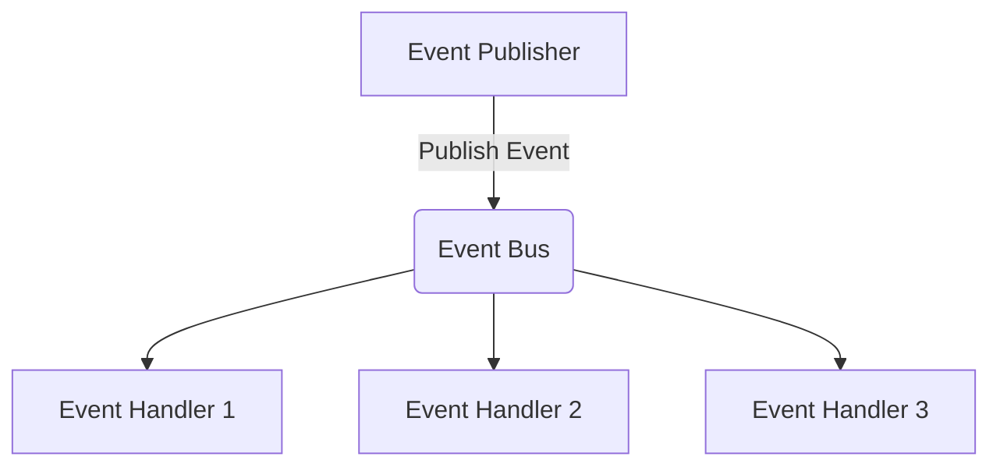

# SimpleEventBus

[English](Readme.md) | [繁體中文](Readme.zh-TW.md)

輕量的 .NET Event Bus 函式庫，以 Fluent Subscription Profile 描述事件訂閱。



## 套件

- `SimpleEventBus`：核心抽象與 Profile 系統
- `SimpleEventBus.InMemory`：In-Process（同進程）傳輸
- `SimpleEventBus.RabbitMq`：RabbitMQ 傳輸

## 目標框架

- `net6.0`
- `net8.0`
- `net9.0`
- `net10.0`

## 快速開始（In-Memory）

### 1. 定義事件與 Handler

```csharp
using SimpleEventBus.Event;
using SimpleEventBus.Subscriber;

public sealed record OrderPlaced(Guid OrderId);

public sealed class OrderPlacedHandler : IEventHandler<OrderPlaced>
{
    public Task HandleAsync(OrderPlaced @event, Headers headers, CancellationToken cancellationToken)
    {
        Console.WriteLine($"Handled order: {@event.OrderId}");
        return Task.CompletedTask;
    }
}
```

### 2. 定義 Subscription Profile

```csharp
using SimpleEventBus.Profile;

public sealed class OrderProfile : SubscriptionProfile
{
    public OrderProfile()
    {
        this.WhenOccurs<OrderPlaced>()
            .ToDo<OrderPlacedHandler>();
    }
}
```

Profile 也可以直接綁定任何已註冊 service 上的方法（簽名為 `(TEvent, Headers, CancellationToken) => Task` 或 `(TEvent, CancellationToken) => Task`），不必實作 `IEventHandler<TEvent>`，並可掛上例外處理器：

```csharp
this.WhenOccurs<OrderPlaced>()
    .ToDo<INotificationService>(s => s.PushAsync)
    .CatchExceptionToDo<OrderPlacedExceptionHandler>();
```

### 3. 註冊 EventBus

```csharp
using Microsoft.Extensions.DependencyInjection;
using Microsoft.Extensions.Hosting;
using SimpleEventBus.DependencyInjection;

var host = Host.CreateDefaultBuilder(args)
    .ConfigureServices(services =>
    {
        services.AddEventBus(builder =>
        {
            builder.WithProfile<OrderProfile>();
            builder.ScanHandlersFrom(typeof(OrderProfile).Assembly);
            builder.UseInMemoryTransport();
        });
    })
    .Build();

await host.StartAsync();
```

單一 Profile 的簡寫：

```csharp
services.AddEventBusWithProfile<OrderProfile, Program>();
```

### 4. 發佈事件

```csharp
using Microsoft.Extensions.DependencyInjection;

var publisher = host.Services.GetRequiredService<IEventPublisher>();
await publisher.PublishAsync(new OrderPlaced(Guid.NewGuid()));
```

## RabbitMQ 傳輸

```csharp
services.AddEventBus(builder =>
{
    builder.WithProfile<OrderProfile>();
    builder.ScanHandlersFrom(typeof(OrderProfile).Assembly);
    builder.UseRabbitMqTransport(
        opt =>
        {
            opt.Host = "localhost";
            opt.UserName = "guest";
            opt.Password = "guest";
        },
        bind =>
        {
            bind.GlobalExchange = "eventbus.topic";
            bind.GlobalQueue = "simpleeventbus.orders";
            bind.PrefetchCount = 10;
        });
});
```

也可以針對特定事件個別綁定：

```csharp
bind.ForEvent<OrderPlaced>()
    .DeclareExchange("orders.exchange")
    .DeclareQueue("orders.queue");
```

## 投遞語意、重試與 Dead Letter

Handler 失敗時例外會傳遞到 transport（除非透過 `CatchExceptionToDo<T>()` 註冊的
`IEventExceptionHandler` 將 `context.Handled = true`，此時訊息會被 ack 並丟棄）。
Transport 接著進行重試：

- **RabbitMQ**：訊息帶著遞增的 `x-retry-count` header 重新發佈，最多 `MaxRetryCount`
  次（預設 `3`）。超過後 nack 不 requeue —— 有設定 dead letter exchange 時進 DLQ，
  否則丟棄。
- **In-Memory**：事件帶著同樣的計數重新入列，最多 `MaxRetryCount` 次（預設 `3`）。
  超過後呼叫 `OnPoisonMessage`（若有設定）並丟棄。

因此投遞語意為 **at-least-once**：handler 必須具備冪等性。

RabbitMQ 設定 dead letter exchange / queue：

```csharp
bind.DeclareGlobalDeadLetter("eventbus.dlx", "simpleeventbus.orders.dlq");
bind.MaxRetryCount = 3;

// 或針對單一事件
bind.ForEvent<OrderPlaced>()
    .DeclareExchange("orders.exchange")
    .DeclareQueue("orders.queue")
    .WithDeadLetter("orders.dlx", "orders.dlq");
```

In-Memory 設定 poison message 處理：

```csharp
builder.UseInMemoryTransport(
    maxRetryCount: 3,
    onPoisonMessage: (context, exception) =>
    {
        Console.WriteLine($"Poison event {context.EventName}: {exception.Message}");
        return Task.CompletedTask;
    });
```

## 事件命名

- 預設 key 格式：`{domain}.{entity}.{event}.v{version}`
- 用 `EventAttribute` 自訂名稱與版本
- 路由細節見 `docs/eventbus-routing.md`

範例：

```csharp
using SimpleEventBus.Mapper;

[Event("order.payment.created", 2)]
public sealed record OrderPaymentCreated(Guid PaymentId);
```

產生的事件名稱：`order.payment.created.v2`

## 路由預設值

依 `docs/eventbus-routing.md`：

- 預設 exchange：`eventbus.topic`
- 預設 queue 格式：`{service}.{environment}`
- `RabbitMqBindingOption.ServiceName` 預設：`app`
- `RabbitMqBindingOption.EnvironmentName` 預設：`prod`
- 預設 prefetch：`10`

事件若未個別設定 binding，RabbitMQ 傳輸會回退使用全域/預設值。

## 效能

使用內附的壓測工具（`src/SimpleEventBus.StressTests`）在開發機上量測——
單一發佈程序、8 個平行 producer、一個計數 handler，所有回合零訊息遺失：

| 情境 | 事件數 | 發佈吞吐 | 端到端處理吞吐 |
|---|---|---|---|
| In-Memory | 100,000 | ~1,150,000 msg/s | ~245,000 msg/s |
| RabbitMQ（Docker，prefetch 200） | 10,000 | ~48,000 msg/s | ~10,500 msg/s |
| RabbitMQ（Docker，prefetch 200） | 100,000 | ~83,000 msg/s | ~16,000 msg/s |

數字僅供參考，非正式 benchmark——可自行重跑：

```bash
# In-Memory
dotnet run -c Release --project src/SimpleEventBus.StressTests -- inmemory 100000

# RabbitMQ（Docker 沙盒）
docker run -d --name eventbus-stress -p 5673:5672 rabbitmq:4-alpine
dotnet run -c Release --project src/SimpleEventBus.StressTests -- rabbitmq localhost:5673 100000
docker rm -f eventbus-stress
```

相關設計決策：handler delegate 與 lambda expression 只編譯一次並快取；
RabbitMQ publisher 快取 exchange declare（每個 exchange 每個 process 只打一次
broker）；所有 RabbitMQ 元件共享單一連線；每個 handler 在自己的 DI scope 中執行。

## 文件

- 路由設計：`docs/eventbus-routing.md`

## 建置與測試

```bash
dotnet build src/SimpleEventBus.sln -c Release
dotnet test src/SimpleEventBus.sln -c Release
```
