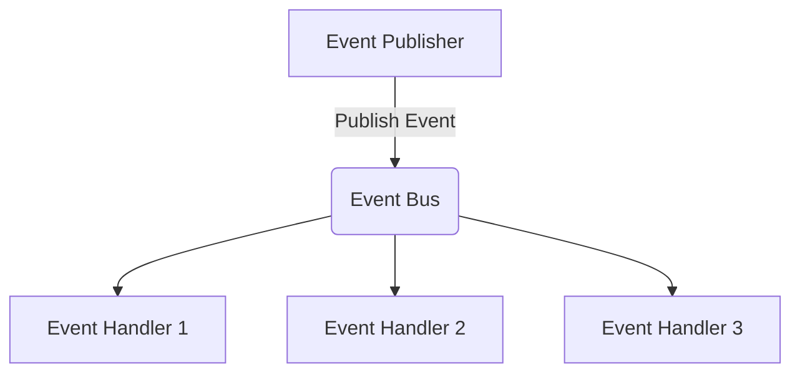

# FluentEventBus

[](https://github.com/Ian26875/FluentEventBus/actions/workflows/ci.yml)
[](https://github.com/Ian26875/FluentEventBus/actions/workflows/release.yml)
[](https://www.nuget.org/packages/FluentEventBus)
[](LICENSE)

[English](Readme.md) | [繁體中文](Readme.zh-TW.md)

輕量的 .NET Event Bus 函式庫，以 Fluent Subscription Profile 描述事件訂閱。



## 套件

以 **FluentEventBus** 系列發佈到 NuGet：

| NuGet 套件 | 專案 | 用途 |
|---|---|---|
| `FluentEventBus` | `FluentEventBus` | 核心抽象與 Profile 系統 |
| `FluentEventBus.InMemory` | `FluentEventBus.InMemory` | In-Process（同進程）傳輸 |
| `FluentEventBus.RabbitMq` | `FluentEventBus.RabbitMq` | RabbitMQ 傳輸 |
| `FluentEventBus.OpenTelemetry` | `FluentEventBus.OpenTelemetry` | OpenTelemetry 接線（net8.0+） |
| `FluentEventBus.AsyncApi` | `FluentEventBus.AsyncApi` | AsyncAPI 3.0 文件產生（net8.0+） |

## 目標框架

- `net6.0`
- `net7.0`
- `net8.0`
- `net9.0`
- `net10.0`

## 快速開始（In-Memory）

### 1. 定義事件與 Handler

```csharp
using FluentEventBus.Event;
using FluentEventBus.Subscriber;

public sealed record OrderPlaced(Guid OrderId);

public sealed class OrderPlacedHandler : IEventHandler<OrderPlaced>
{
    public Task HandleAsync(OrderPlaced @event, Headers headers, CancellationToken cancellationToken)
    {
        Console.WriteLine($"Handled order: {@event.OrderId}");
        return Task.CompletedTask;
    }
}
```

### 2. 定義 Subscription Profile

```csharp
using FluentEventBus.Profile;

public sealed class OrderProfile : SubscriptionProfile
{
    public OrderProfile()
    {
        this.WhenOccurs<OrderPlaced>()
            .ToDo<OrderPlacedHandler>();
    }
}
```

Profile 也可以直接綁定任何已註冊 service 上的方法（簽名為 `(TEvent, Headers, CancellationToken) => Task` 或 `(TEvent, CancellationToken) => Task`），不必實作 `IEventHandler<TEvent>`，並可掛上例外處理器：

```csharp
this.WhenOccurs<OrderPlaced>()
    .ToDo<INotificationService>(s => s.PushAsync)
    .CatchExceptionToDo<OrderPlacedExceptionHandler>();
```

### 3. 註冊 EventBus

```csharp
using Microsoft.Extensions.DependencyInjection;
using Microsoft.Extensions.Hosting;
using FluentEventBus.DependencyInjection;

var host = Host.CreateDefaultBuilder(args)
    .ConfigureServices(services =>
    {
        services.AddEventBus(builder =>
        {
            builder.WithProfile<OrderProfile>();
            builder.ScanHandlersFrom(typeof(OrderProfile).Assembly);
            builder.UseInMemoryTransport();
        });
    })
    .Build();

await host.StartAsync();
```

單一 Profile 的簡寫：

```csharp
services.AddEventBusWithProfile<OrderProfile, Program>();
```

### 4. 發佈事件

```csharp
using Microsoft.Extensions.DependencyInjection;

var publisher = host.Services.GetRequiredService<IEventPublisher>();
await publisher.PublishAsync(new OrderPlaced(Guid.NewGuid()));
```

## RabbitMQ 傳輸

```csharp
services.AddEventBus(builder =>
{
    builder.WithProfile<OrderProfile>();
    builder.ScanHandlersFrom(typeof(OrderProfile).Assembly);
    builder.UseRabbitMqTransport(
        opt =>
        {
            opt.Host = "localhost";
            opt.UserName = "guest";
            opt.Password = "guest";
        },
        bind =>
        {
            bind.GlobalExchange = "eventbus.topic";
            bind.GlobalQueue = "fluenteventbus.orders";
            bind.PrefetchCount = 10;
        });
});
```

也可以針對特定事件個別綁定：

```csharp
bind.ForEvent<OrderPlaced>()
    .DeclareExchange("orders.exchange")
    .DeclareQueue("orders.queue");
```

## 投遞語意、重試與 Dead Letter

Handler 失敗時例外會傳遞到 transport（除非透過 `CatchExceptionToDo<T>()` 註冊的
`IEventExceptionHandler` 將 `context.Handled = true`，此時訊息會被 ack 並丟棄）。
Transport 接著進行重試：

- **RabbitMQ**：訊息帶著遞增的 `x-retry-count` header 重新發佈，最多 `MaxRetryCount`
  次（預設 `3`）。超過後 nack 不 requeue —— 有設定 dead letter exchange 時進 DLQ，
  否則丟棄。
- **In-Memory**：事件帶著同樣的計數重新入列，最多 `MaxRetryCount` 次（預設 `3`）。
  超過後呼叫 `OnPoisonMessage`（若有設定）並丟棄。

因此投遞語意為 **at-least-once**：handler 必須具備冪等性——請用
`Headers.MessageId` 作為去重（deduplication）依據。

RabbitMQ 設定 dead letter exchange / queue：

```csharp
bind.DeclareGlobalDeadLetter("eventbus.dlx", "fluenteventbus.orders.dlq");
bind.MaxRetryCount = 3;

// 或針對單一事件
bind.ForEvent<OrderPlaced>()
    .DeclareExchange("orders.exchange")
    .DeclareQueue("orders.queue")
    .WithDeadLetter("orders.dlx", "orders.dlq");
```

In-Memory 設定 poison message 處理：

```csharp
builder.UseInMemoryTransport(
    maxRetryCount: 3,
    onPoisonMessage: (context, exception) =>
    {
        Console.WriteLine($"Poison event {context.EventName}: {exception.Message}");
        return Task.CompletedTask;
    });
```

## Message Headers

每則訊息都帶一個 `Headers` 字典。標準 header：

| Header | 由誰設定 | 用途 |
|---|---|---|
| `MessageId` | Publisher 自動填（GUID，未設定時） | 訊息唯一識別——at-least-once 去重的依據 |
| `OccurredAt` | Publisher 自動填（UTC，ISO-8601，未設定時） | 事件發佈時間 |
| `CorrelationId` | 呼叫端（選填） | 跨服務端到端追蹤 |
| `x-retry-count` | Transport | 重試/dead letter 流程的重投計數 |

```csharp
await publisher.PublishAsync(orderPlaced, new Headers { CorrelationId = requestId });

// consumer 端
public Task HandleAsync(OrderPlaced @event, Headers headers, CancellationToken ct)
{
    var messageId = headers.MessageId;   // 去重 key
    var occurredAt = headers.OccurredAt; // DateTimeOffset?
    ...
}
```

訊息 body 的合約 = JSON payload + 邏輯事件名稱——**CLR type name、namespace、
assembly name 一律不上 wire**。Consumer 用邏輯名稱對回自己本地的型別，因此
producer 端 refactor 與非 .NET consumer 都不會被影響。

## OpenTelemetry

Bus 會發出 publish/consume span（`ActivitySource`："FluentEventBus"）與計數器
（`Meter`："FluentEventBus"）。Trace context 以 W3C `traceparent` 放在訊息 header
中傳遞，因此 publisher 與 consumer 服務會串成同一條分散式 trace。

使用 `FluentEventBus.OpenTelemetry` 套件（net8.0+）：

```csharp
services.AddOpenTelemetry()
    .WithTracing(tracing => tracing.AddFluentEventBusInstrumentation())
    .WithMetrics(metrics => metrics.AddFluentEventBusInstrumentation());
```

不裝套件（如 net6/net7）也能直接註冊名稱：

```csharp
tracing.AddSource("FluentEventBus");
metrics.AddMeter("FluentEventBus", "FluentEventBus.InMemory");
```

## 事件命名

- 預設 key 格式：`{domain}.{entity}.{event}.v{version}`
- 用 `EventAttribute` 自訂名稱與版本
- 路由細節見 `docs/eventbus-routing.md`

範例：

```csharp
using FluentEventBus.Mapper;

[Event("order.payment.created", 2)]
public sealed record OrderPaymentCreated(Guid PaymentId);
```

產生的事件名稱：`order.payment.created.v2`

## 事件版本演進（Event Versioning）

版本是 routing key 的一部分（`...created.v1` / `...created.v2`），因此每個版本
就是獨立的 channel，遷移期間新舊版本可並存。

**不需升版**——僅限 additive、非破壞性變更：新增 optional 欄位。Payload 是
JSON，舊 consumer 會忽略不認識的欄位。

**必須升版**——任何破壞性變更：欄位改名、刪除、改型別，或事件語意改變。

**升版做法**——定義*新的* CLR type，絕不修改舊 type（`EventMapper` 的 type ↔
name 是一對一，同一個 type 不能承載兩個版本）：

```csharp
[Event("order.payment.created", 1)]
public sealed record OrderPaymentCreated(Guid PaymentId);

[Event("order.payment.created", 2)]
public sealed record OrderPaymentCreatedV2(Guid PaymentId, string Currency);
```

**遷移步驟**：

1. Consumer 先雙訂閱新舊版本：

   ```csharp
   this.WhenOccurs<OrderPaymentCreated>().ToDo<PaymentHandler>();
   this.WhenOccurs<OrderPaymentCreatedV2>().ToDo<PaymentHandlerV2>();
   ```

2. Producer 切換到發佈 v2。
3. 監控 v1 queue 流量歸零後，移除 v1 訂閱與型別。

**為什麼只有 major**：`EventAttribute` 刻意只帶 major 版號。minor/patch 不改
wire contract，就不該出現在 routing key 上。

**Contract 穩定性**：跨服務共用的事件一律加明文 `[Event("name", n)]`。沒加時
名稱由型別名與 namespace 推導，refactor 會無聲改掉 routing key——這是編譯器
抓不到的 breaking change。

## AsyncAPI 文件

`FluentEventBus.AsyncApi` 套件（net8.0+，基於 AsyncAPI 官方 .NET SDK）直接從
subscription profiles 產出 AsyncAPI 3.0 文件——事件名稱變 channels、handler 變
receive operations、事件型別變 payload JSON Schema，不需要任何額外標註。

```csharp
services.AddEventBus(builder =>
{
    builder.WithProfile<OrderProfile>();
    builder.UseInMemoryTransport();
    builder.AddAsyncApiDocument(options =>
    {
        options.Title = "Orders Service";
        options.Version = "1.0.0";
        options.WithExample(new OrderPlaced(Guid.NewGuid()), name: "typical-order");
        options.WithXmlComments<OrderPlaced>(); // 型別/屬性的 <summary> 會變成文件描述
        // Servers 會自動從已設定的 transport 探索（IEventBusServerDescriptor）；
        // WithServer(...) 可另外新增或覆蓋：
        options.WithServer("production", "rabbitmq.internal:5672", "amqp", protocolVersion: "0.9.1");
    });
});
```

輸出方式自由選擇，例如 minimal API endpoint：

```csharp
app.MapGet("/asyncapi.json", async (AsyncApiDocumentGenerator generator, CancellationToken ct) =>
    Results.Content(await generator.SerializeAsync(AsyncApiDocumentFormat.Json, ct), "application/json"));
```

註冊的 document provider 也會直接餵給 Neuroglia AsyncAPI UI——加上
`Neuroglia.AsyncApi.AspNetCore.UI` 套件、`AddAsyncApi()` + `AddAsyncApiUI()` 與
Razor Pages，`/asyncapi` 就有互動式文件頁面。

可執行範例（含 Dockerfile）見 `samples/AsyncApiSample`。

## 路由預設值

依 `docs/eventbus-routing.md`：

- 預設 exchange：`eventbus.topic`
- 預設 queue 格式：`{service}.{environment}`
- `RabbitMqBindingOption.ServiceName` 預設：`app`
- `RabbitMqBindingOption.EnvironmentName` 預設：`prod`
- 預設 prefetch：`10`

事件若未個別設定 binding，RabbitMQ 傳輸會回退使用全域/預設值。

## 效能

使用內附的壓測工具（`src/FluentEventBus.StressTests`）在開發機上量測——
單一發佈程序、8 個平行 producer、一個計數 handler，所有回合零訊息遺失：

| 情境 | 事件數 | 發佈吞吐 | 端到端處理吞吐 |
|---|---|---|---|
| In-Memory | 100,000 | ~1,150,000 msg/s | ~245,000 msg/s |
| RabbitMQ（Docker，prefetch 200） | 10,000 | ~48,000 msg/s | ~10,500 msg/s |
| RabbitMQ（Docker，prefetch 200） | 100,000 | ~83,000 msg/s | ~16,000 msg/s |

數字僅供參考，非正式 benchmark——可自行重跑：

```bash
# In-Memory
dotnet run -c Release --project src/FluentEventBus.StressTests -- inmemory 100000

# RabbitMQ（Docker 沙盒）
docker run -d --name eventbus-stress -p 5673:5672 rabbitmq:4-alpine
dotnet run -c Release --project src/FluentEventBus.StressTests -- rabbitmq localhost:5673 100000
docker rm -f eventbus-stress
```

相關設計決策：handler delegate 與 lambda expression 只編譯一次並快取；
RabbitMQ publisher 快取 exchange declare（每個 exchange 每個 process 只打一次
broker）；所有 RabbitMQ 元件共享單一連線；每個 handler 在自己的 DI scope 中執行。

## 文件

- 路由設計：`docs/eventbus-routing.md`

## 建置與測試

```bash
dotnet build src/FluentEventBus.sln -c Release
dotnet test src/FluentEventBus.sln -c Release
```
